# Steps for Data Loading, Analysis, and Classification in Python

### Step 1
We loaded the data using the function `np.loadtxt` and extracted only the first column from both the train and test datasets. These were split into **features** and **labels**.


---

### Step 2
From the training dataset, we selected sample number 131. After reshaping it into a `16x16` matrix, it appears as follows:
<div style="display: flex; justify-content: center; align-items: center; gap: 2rem; margin: 0 auto;">

   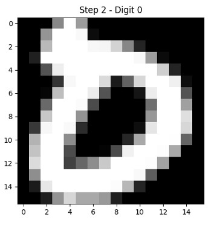
</div>

---

### Step 3
Using the same process, we visualized a random sample for each of the ten digits. The random selection was performed with the function `np.random.choice` on each subset of the training array.

<div style="display: flex; justify-content: center; align-items: center; gap: 2rem; margin: 0 auto;">
   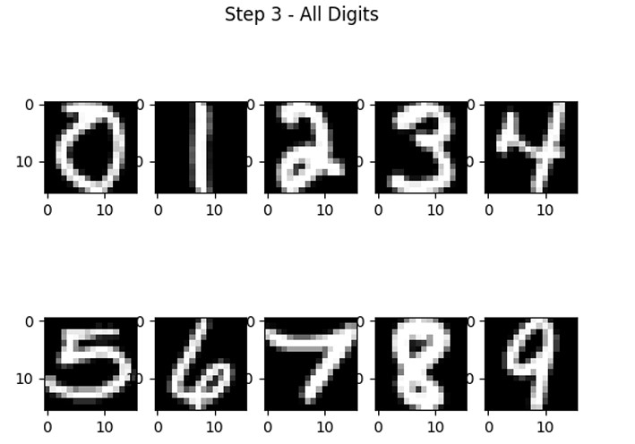
</div>

---

### Step 4
We calculated the mean of all pixel values at position `(10,10)` for digit 0 using the function `np.mean`. The result was `-0.927264`.

---

### Step 5
Similarly, the variance of all pixel values at position `(10,10)` for digit 0 was computed using `np.var`. The resulting value was `-0.083924`.

---

### Steps 6-8
By applying the above functions to all pixels for digit 0:
- **Mean values** give a visual approximation of digit 0.
- **Variances** highlight the pixels with the most significant differences, with higher variances at the "edges" of the digit and almost zero variance in the central or corner areas, which are typically empty.

Reshaping the mean and variance arrays produces visual diagrams that reveal these patterns.
<div style="display: flex; justify-content: center; align-items: center; gap: 2rem; margin: 0 auto;">
   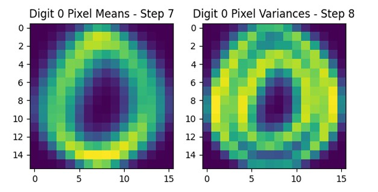
</div>

---

### Step 9
We extended the above process to all digits. Visualizing the digit approximations from the calculated mean values yielded distinct results for each digit.

<div style="display: flex; justify-content: center; align-items: center; gap: 2rem; margin: 0 auto;">
   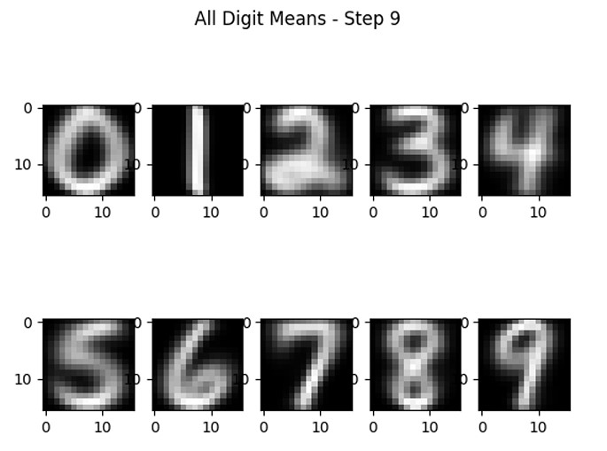
</div>

---

### Step 10
To classify sample number 101:
1. We calculated its **Euclidean Distance** from all **Class Means** using:
   ```python
   dist = np.linalg.norm(final_means - digit, axis=1, ord=2)
   pred_class = np.argmin(dist)
   ```

The first command gives us the L2 Norm of the final matrix of distances between the sample and the Class Means. The L2 Norm corresponds to the Euclidean Distance. In the second command, we compute the Class Index that corresponds to the smallest distance, representing the predicted digit. Specifically, if we visualize sample 101, it appears as follows:

<div style="display: flex; justify-content: center; align-items: center; gap: 2rem; margin: 0 auto;">
   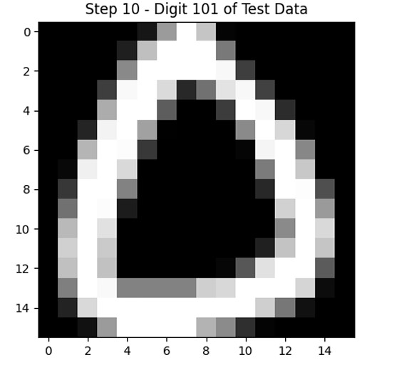
</div>

The Euclidean Distance classifier explained earlier successfully classifies the above sample into class 0.

### Step 11
Using the same procedure, we classify all samples in the Test Set into one of the ten classes based on the Euclidean Distance. Then, we calculate the final Accuracy of our classifier as follows:
$$\[
\text{Accuracy} = \frac{\text{Number of correctly classified samples}}{\text{Total number of samples}}
\]$$
The final Accuracy of our classifier is **81.415%**.

### Step 12
The Scikit-Learn library requires classifiers to be classes implementing the `fit`, `predict`, and `score` functions. By incorporating the above functions and procedures, we created the following class (compatible with sklearn):

<div style="display: flex; justify-content: center; align-items: center; gap: 2rem; margin: 0 auto;">
   
</div>

### Step 13
#### a) Using sklearn compatibility, we can directly apply the `cross_val_score` function, which calculates the K-Fold Cross Validation Score of the classifier. For the Euclidean Classifier created earlier, the 5-Fold Cross Validation Accuracy Score on the train data is **84.858%**. This score is higher than the Test Set score, as expected, due to the difference in size between the Train and Test Sets and because `cross_val_score` averages 5 different evaluations of the model.

#### b) To visualize the classifier's decision region in a 2-D diagram, we reduce the dimensionality of the data from 256 to 2 using PCA (implemented in sklearn). This provides two combinations of the 256 dimensions with the highest variance, containing the most information. After reducing dimensionality and training the classifier on the 2 features, we can plot the decision region in a 2-D diagram as follows:

We observe distinct clusters for different classes in the respective regions of the 2 new features, with some minor overlap, indicating a few misclassified samples.

<div style="display: flex; justify-content: center; align-items: center; gap: 2rem; margin: 0 auto;">
   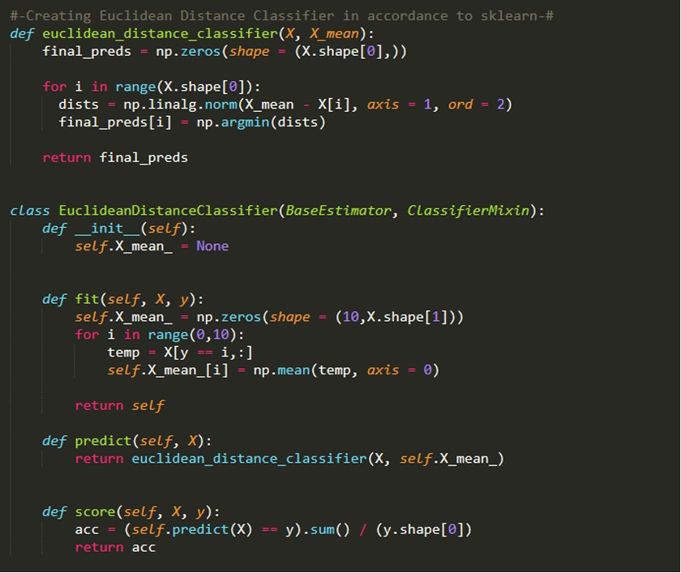
</div>
#### c) For the Learning Curve, we use the `learning_curve` function from sklearn, which takes the classifier, data, and Cross-Validation Folds as input. The resulting learning curve is as follows:

<div style="display: flex; justify-content: center; align-items: center; gap: 2rem; margin: 0 auto;">
   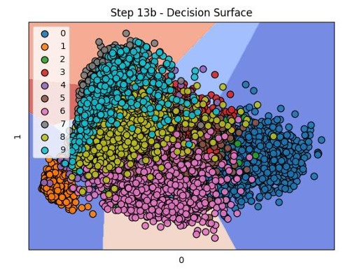
</div>

The classifier begins to "learn" the task when the Train Set reaches approximately 2000 samples. Beyond that, the score stabilizes around **86%**.

### Step 14
The Naive Bayes Classifier operates by calculating the probability of a sample $$\( x \)$$ belonging to each classification class. Specifically, it uses Bayes' Theorem:
$$\[
P(\omega_i|x) = \frac{P(\omega_i)P(x|\omega_i)}{P(x)}
\]$$
The a-priori probabilities $$\( P(\omega_i) \)$$ for the classes are calculated as:
$$\[
P(\omega_i) = \frac{\text{Number of samples in class } \omega_i}{\text{Total number of samples}}
\]$$
This is implemented using `np.unique`, which returns the sample counts for each class, divided by the total sample count.

### Step 15
To implement the Custom Naive Bayes Classifier compatible with scikit-learn:
- **Fit**: Computes mean values, variances, and a-priori probabilities for each class from the input data. It also supports a `unit_variance` mode, where the variance matrix is set to the identity matrix.

<div style="display: flex; justify-content: center; align-items: center; gap: 2rem; margin: 0 auto;">
   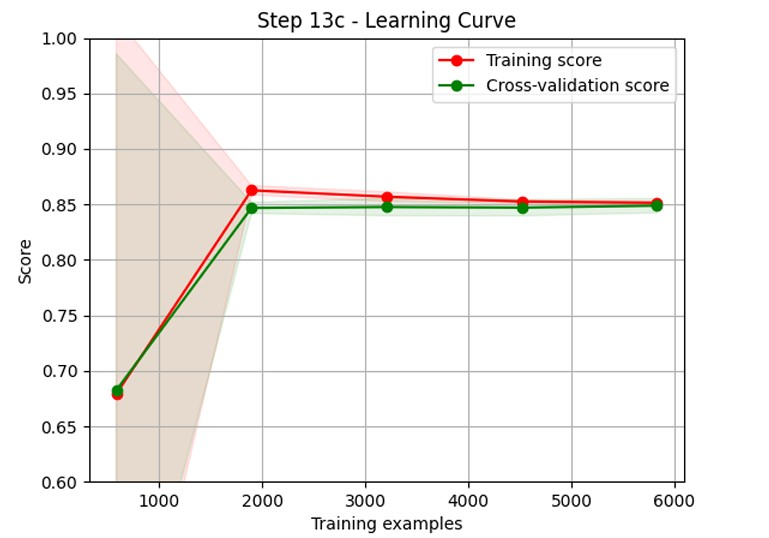
</div>

- **Predict**: Assumes independent features for samples. Using simple multiplication, we calculate the a-posteriori probabilities. Each pixel of a digit follows a Gaussian distribution, defined by the mean and variance calculated during fitting. With `multivariate_normal` (allowing singular covariance matrices), we compute probabilities using a vector of variances, converted internally to a diagonal matrix. The class with the highest a-posteriori probability is the predicted one.


<div style="display: flex; justify-content: center; align-items: center; gap: 2rem; margin: 0 auto;">
   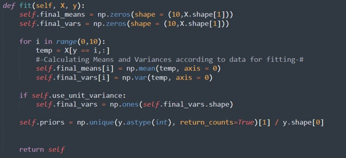
</div>

- **Score**: Using the `score` method, the Custom Naive Bayes achieved **74.79%** on the Test Set, while sklearn's Naive Bayes achieved **71.948%**. The custom implementation performed better as it supports zero variances, unlike sklearn, which applies smoothing.


<div style="display: flex; justify-content: center; align-items: center; gap: 2rem; margin: 0 auto;">
   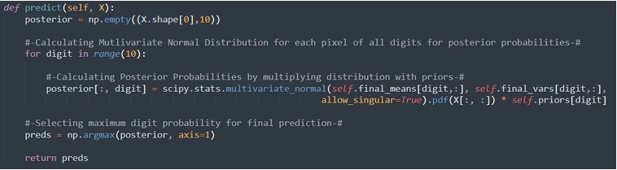
</div>

### Step 16
Recomputing the score with unit variance resulted in **81.266%**, indicating that performance improves with unit variance due to potentially inaccurate variance values from pixel data. With more data, variance estimates might converge better to actual values.

### Step 17
For classifier comparison, we used sklearn implementations of Naive Bayes, Nearest Neighbors, and SVM. Results are as follows:

| Classifier               | Score       |
|--------------------------|-------------|
| SKLearn Naive Bayes      | 71.948%     |
| SKLearn 3-NN             | 94.469%     |
| SKLearn 5-NN             | 94.469%     |
| SKLearn 7-NN             | 94.170%     |
| SKLearn SVM (Linear)     | 92.626%     |
| SKLearn SVM (Poly)       | 95.366%     |
| SKLearn SVM (RBF)        | 94.718%     |

Naive Bayes performed the worst, while K-NN and SVM achieved similar performance, with SVM (Poly) slightly outperforming.

### Step 18
To enhance classifier performance, we used two ensemble methods:
- **Voting Classifier**: Hard voting was employed (as Custom Naive Bayes lacks probability output). Using Custom Naive Bayes, sklearn Naive Bayes, 3-NN, 5-NN, and Poly SVM, the score was **94.569%**. Adding lower-performing classifiers alongside Poly SVM caused errors.
- **Bagging Classifier**: With 20 estimators using Custom Naive Bayes, we achieved **78.376%**, an improvement of 1%.

### Step 19
For PyTorch compatibility, data was loaded as Pytorch DataLoader batches of size 16 for Train, Test, and Validation Sets. The validation set comprised 20% of the Train Set. 
- Neural network architecture included 3 hidden layers (300, 200, 100), ReLU activation for hidden layers, and Softmax for the output layer to produce probability distributions.
- Training utilized AdamW optimizer, CrossEntropyLoss, and LambdaLR scheduler (λ=0.95). During each epoch, `running_loss` was updated every 100 batches for Train and Validation Loss. Over 30 epochs, Train and Validation Loss remained low, avoiding overfitting. Example from the last 10 epochs:

<div style="display: flex; justify-content: center; align-items: center; gap: 2rem; margin: 0 auto;">
   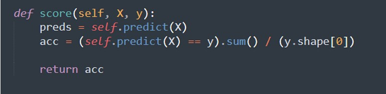
</div>

The model achieved **93.124%** on the Test Set.
