# Waveforms and Spectrograms Analysis

## Overview
The analysis focuses on waveforms and spectrograms derived from audio signals belonging to two speakers: Speaker 1 and Speaker 8. These tools are crucial in audio analysis as they provide insights into the temporal and spectral characteristics of sound. 

- **Waveforms** display the amplitude of the audio signal over time, offering a visual representation of the sound's energy.
- **Spectrograms** visualize how frequencies vary over time, making them ideal for understanding pitch, tone, and other spectral features. They are generated by performing a Short-Time Fourier Transform (STFT) on the signal, dividing it into overlapping windows to capture time-varying frequency content.

   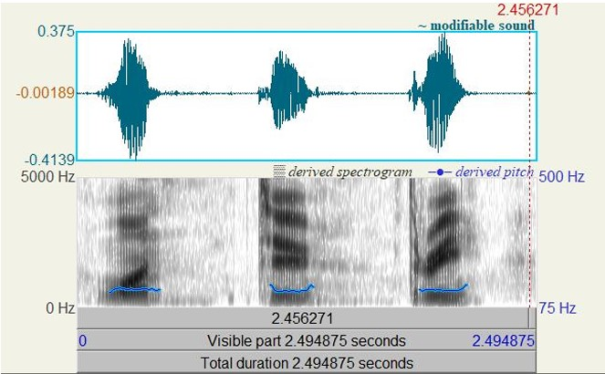
   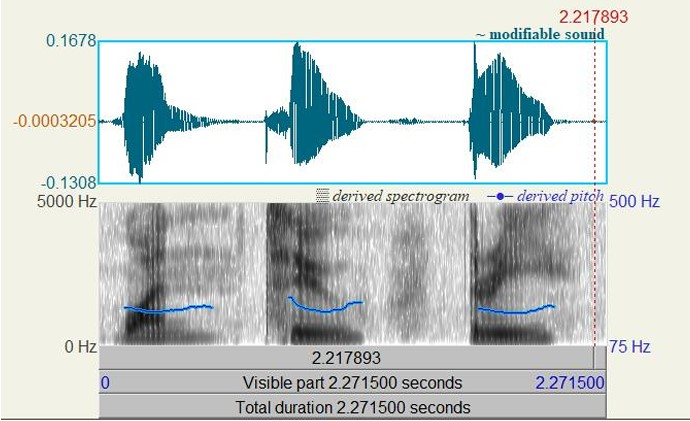

### Speaker-Specific Characteristics
#### Speaker 1 (Male Voice)
- **Average Pitch**:
  - /a/: ~134.31 Hz
  - /u/: ~128.82 Hz
  - /i/: ~130.88 Hz
- **Formants**:
  - /a/: 178.82 Hz, 786.53 Hz, 1057.93 Hz, 2338.43 Hz
  - /u/: 347.56 Hz, 1783.35 Hz, 2353.65 Hz
  - /i/: 332.52 Hz, 2182.52 Hz, 2965.08 Hz

#### Speaker 8 (Female Voice)
- **Average Pitch**:
  - /a/: ~176.25 Hz
  - /u/: ~186.49 Hz
  - /i/: ~2029.38 Hz
- **Formants**:
  - /a/: 925.39 Hz, 1664.94 Hz, 3061.81 Hz
  - /u/: 391.86 Hz, 2029.38 Hz, 2517.18 Hz
  - /i/: 324.43 Hz, 1670.77 Hz, 2648.22 Hz

#### Observations
- Female voices (Speaker 8) typically exhibit higher fundamental frequencies compared to male voices (Speaker 1) due to smaller and thinner vocal cords.
- Differences in formant frequencies reflect variations in the vocal tract's size and shape, highlighting distinct vowel resonance characteristics.

---

## Step 4: MFCC and MFSC Analysis
### MFCC (Mel-Frequency Cepstral Coefficients)
MFCCs summarize the frequency spectrum in a manner reflecting human hearing, using the mel scale and Discrete Cosine Transform (DCT). They are often employed in speech recognition and classification tasks.

   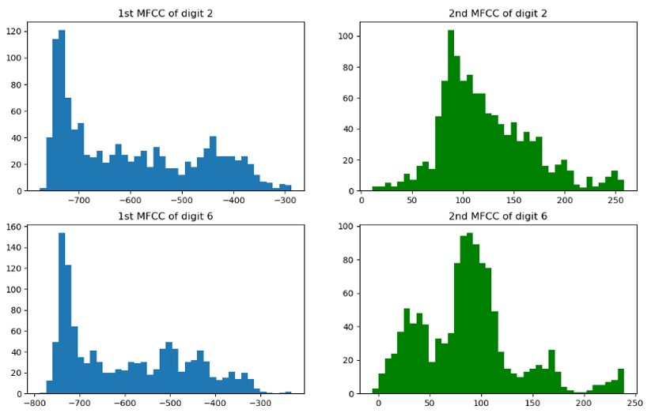

### MFSC (Mel-Frequency Spectral Coefficients)
Unlike MFCCs, MFSCs are derived from the **`melspectrogram`** function, omitting the final DCT step. As a result, MFSCs retain higher correlation between coefficients.

   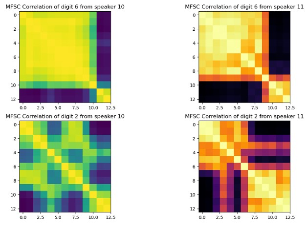
   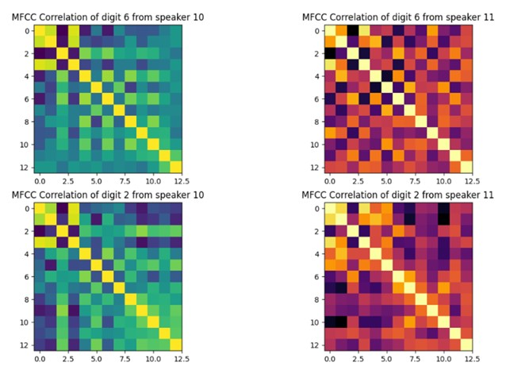

#### Key Findings
- **Correlation**:
  - MFSCs exhibit strong inter-coefficient correlations.
  - MFCCs have weaker inter-coefficient correlations, making them more information-dense and suitable for prediction tasks.
- **Histogram Visualization**:
  Comparative histograms of MFCCs for digits 2 and 6 reveal significant differences between distinct MFCCs, enabling digit differentiation.

---

## Step 5: MFCC Concatenation and Feature Extraction
To construct a robust feature set, MFCCs were concatenated with their first-order (Delta) and second-order (Delta-Delta) derivatives. By calculating the mean and standard deviation along the temporal window axis, we generated 78 features in total (`13 * 3 * 2`).

   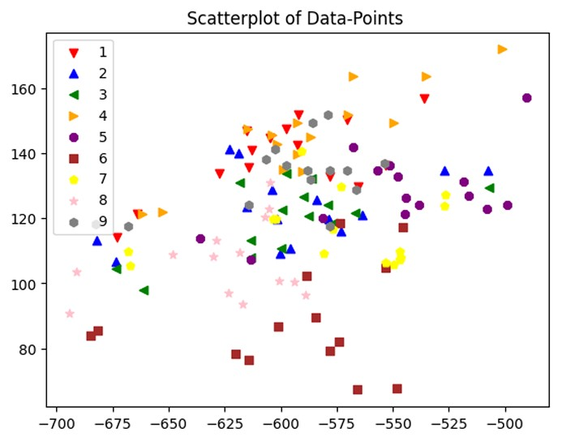

### Scatter Plot Analysis
Using the first two features, scatter plots indicated potential clustering among the data. However, the clusters were not distinctly separable, complicating classification—especially for linear classifiers.

---

## Step 6: Dimensionality Reduction via PCA

### 2D PCA
Principal Component Analysis (PCA) reduced the features to two dimensions, retaining 70.65% of the original variance. The scatter plot showed clearer clustering compared to the original feature space but at the cost of losing 30% of the total information.

   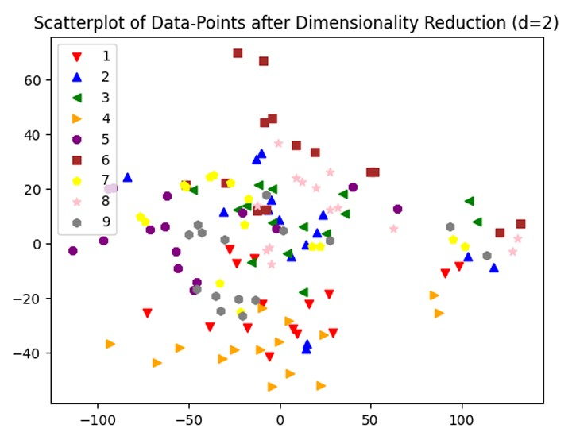

### 3D PCA
Extending PCA to three dimensions improved variance retention to 81.49%, while further enhancing the visual separability of clusters. 

   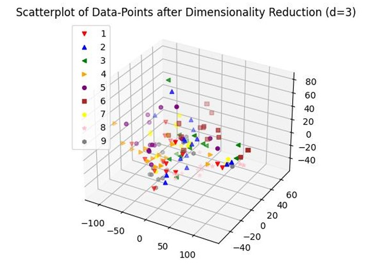

#### Tradeoff
Dimensionality reduction improves visual representation and computational efficiency but comes with a tradeoff: the loss of 20–30% of the original information.

---

## Step 7: Classification and Normalization
### Data Normalization
Data normalization was performed using **StandardScaler** to standardize feature distributions for consistent classifier performance.

### Classifier Results
Using the normalized dataset, five classifiers were trained with the following results:

| Classifier             | Accuracy |
|------------------------|----------|
| Custom Naive Bayes     | 65.00%   |
| SKLearn Naive Bayes    | 65.00%   |
| SKLearn SVM (RBF)      | 57.50%   |
| SKLearn MLP            | 50.00%   |
| SKLearn Random Forest  | 80.00%   |

#### Observations
- Random Forest outperformed other models, achieving the highest accuracy.
- Due to the small sample size, performance was highly dependent on the random split of the dataset, leading to variability in results.

## Implementation of CustomRNN

The **CustomRNN** class supports three types of recurrent neural networks (RNNs):
1. **Vanilla RNN**

   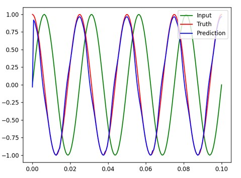

2. **LSTM (Long Short-Term Memory)**

   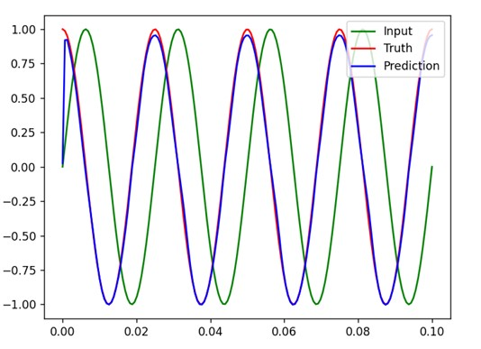

3. **GRU (Gated Recurrent Unit)**

   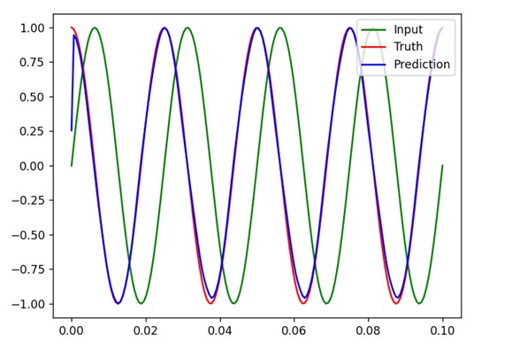

### Training Configuration
- **Epochs**: 200
- **Number of Layers**: 2 stacked RNN layers
- **Hidden Size**: 20

### Results
#### Vanilla RNN
- **Final Loss**: 0.053
- **Prediction Plot**: Demonstrates moderate accuracy but less smoothness in predictions compared to LSTM and GRU.

#### LSTM
- **Final Loss**: 0.049
- **Prediction Plot**: Achieved smoother waveforms than Vanilla RNN, showcasing better generalization.

#### GRU
- **Final Loss**: 0.049
- **Prediction Plot**: Similar performance to LSTM with equally smooth predictions.

### Observations
- LSTM and GRU outperformed Vanilla RNN in terms of prediction smoothness.
- LSTM and GRU address the **vanishing gradient** and **exploding gradient** problems inherent in Vanilla RNN, making them more robust for training.

## Stratified Split (Step 9)
To ensure that labels are distributed evenly across the training and test sets, we used the **stratify** parameter of the `train_test_split` function. This guarantees identical label distributions in the train and test datasets.

## Transition Matrix Initialization (Step 10)
The transition probabilities $$\(a_{ij}\)$$, initial state probabilities $$\(\pi_i\)$$, and final state probabilities $$\(e_i\)$$ were initialized as follows:
1. **Transition Probabilities**:
   - $$\(a_{ii} = a_{i, i+1} = 0.5\)$$ for $$\(i < n_{\text{states}}\)$$ (probabilities sum to 1).
   - $$\(a_{ii} = 1.0\)$$ for $$\(i = n_{\text{states}}\)$$ (final state does not transition elsewhere).
2. **Initial Probabilities**:
   - $$\(\pi_i = 0\)$$ for $$\(i > 0\)$$.
   - $$\(\pi_i = 1\)$$ for $$\(i = 0\)$$ (always starts in the first state).
3. **Final Probabilities**:
   - $$\(e_i = 0\)$$ for $$\(i < n_{\text{states}}\)$$.
   - $$\(e_i = 1\)$$ for $$\(i = n_{\text{states}}\)$$ (always ends in the last state).

## Hyperparameter Optimization (Step 12)
The **validation set** was used to fine-tune the model's hyperparameters, avoiding overfitting to the test set. This prevents data leakage and ensures reliable performance evaluation.

### Grid Search
Hyperparameters explored:
- **Number of GMM Mixtures**: 1–5
- **Number of HMM States**: 1–4
- **Max Iterations for EM Algorithm**: 1–63

### Best Model
- **3 GMM Mixtures**
- **4 HMM States**
- **50 Maximum Iterations**

**Validation Set Accuracy**: 54.4%  
**Test Set Accuracy**: 55.33%

   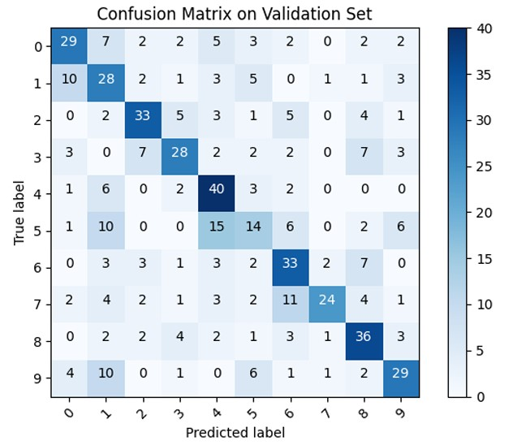
   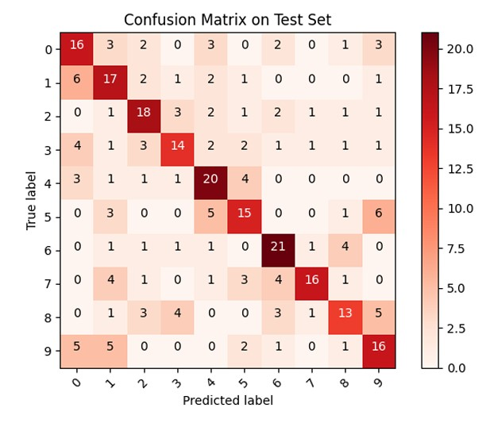

## CustomLSTM Implementation and Improvements (Step 14)
The **CustomLSTM** model comprises:
- **2 LSTM layers**
- **2 Dropout layers**
- **2 Fully Connected Layers**
- **Softmax Output Layer**

### Training Setup
- **Optimizer**: AdamW
- **Learning Rate Scheduler**: Exponential_LR
- **Epochs**: 100
- **Efficiency Technique**: `pack_padded_sequence` to accelerate training.

### Model Improvements
#### 1. Baseline LSTM
- **Validation Accuracy**: 67.59%
- **Test Accuracy**: 66.66%
- Moderate generalization and accuracy.

   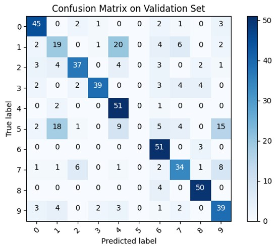
   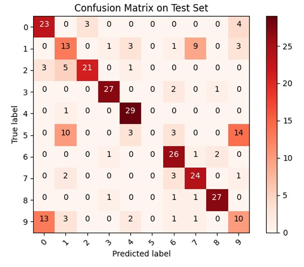

   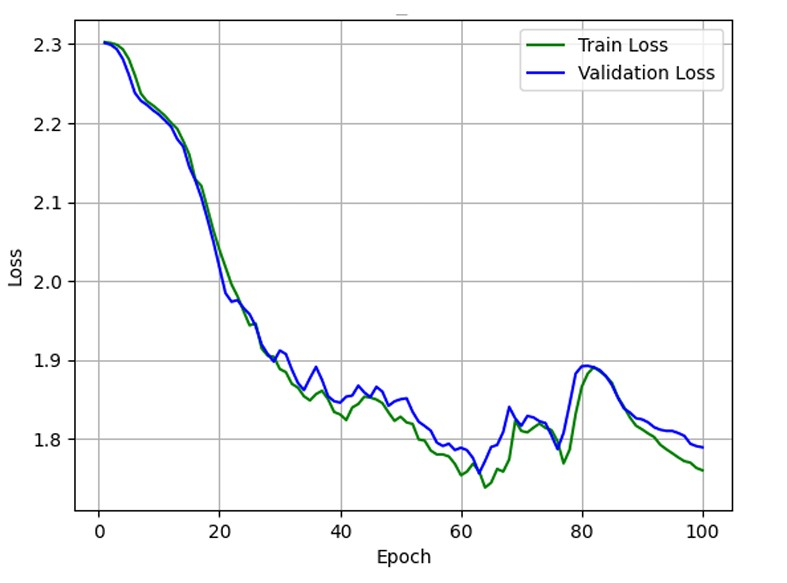

#### 2. Dropout and L2 Regularization
- **Dropout**: Randomly zeroes neuron inputs with a 30% probability to prevent overfitting.
- **L2 Regularization**: Adds a penalty term to the loss function to prevent large weights.
- **Validation Accuracy**: 76.11%
- **Test Accuracy**: 77.66%
- Significant improvement in generalization.

   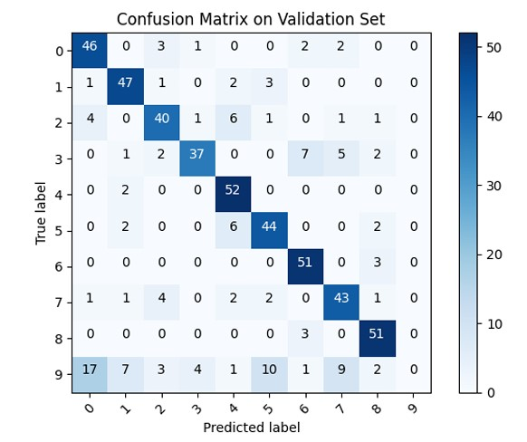
   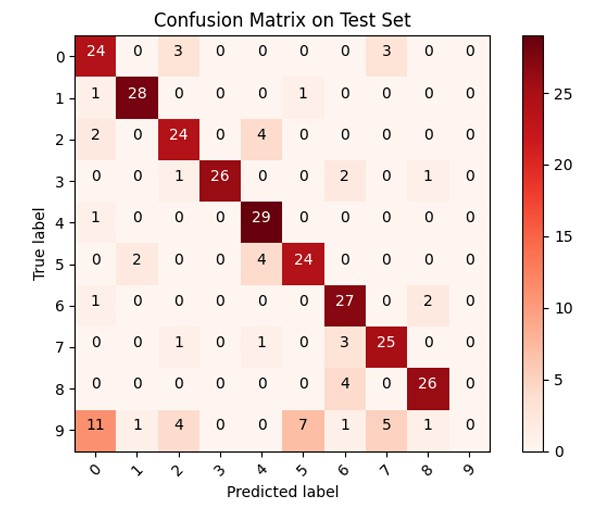

   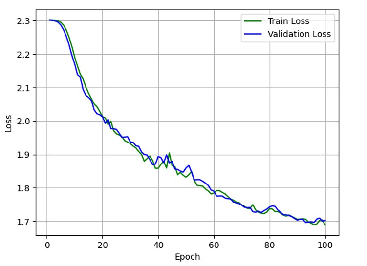

#### 3. Early Stopping and Checkpoints
- **Early Stopping**: Training halted at epoch 76 when validation loss stopped decreasing for 7 consecutive epochs.
- **Validation Accuracy**: 73.3%
- **Test Accuracy**: 78%
- Reduced overfitting and improved robustness.

   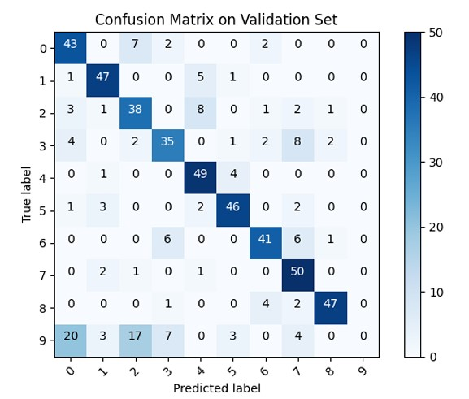
   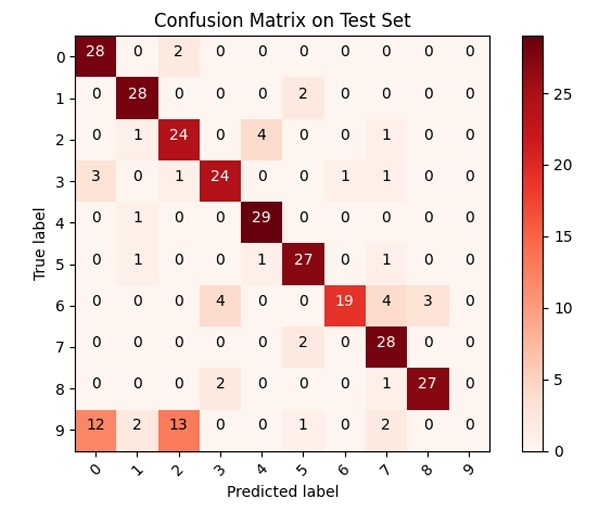

   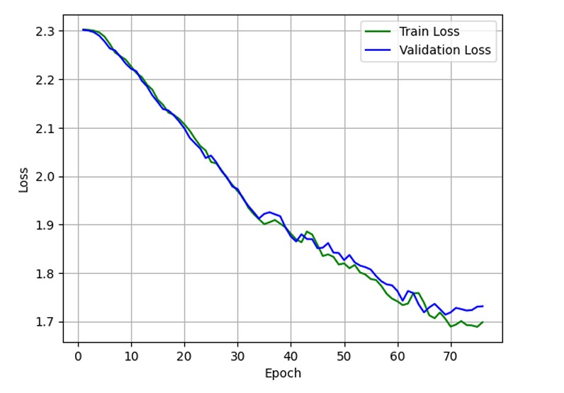

#### 4. Bidirectional LSTM
- **Bidirectionality**: Processes input in both forward and backward directions, improving context understanding.
- **Validation Accuracy**: 93.3%
- **Test Accuracy**: 93.3%
- Achieved a 15% increase in accuracy over the baseline.

   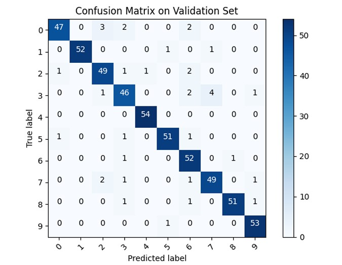
   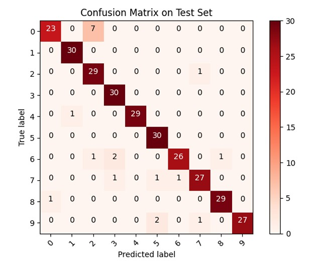

   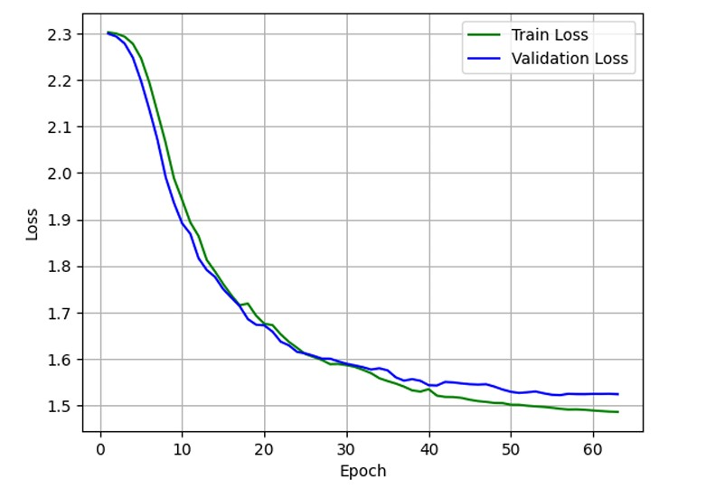

### Conclusion
The best improvement was achieved using the **Bidirectional LSTM**, leveraging bidirectional processing to enhance model understanding and generalization significantly.
